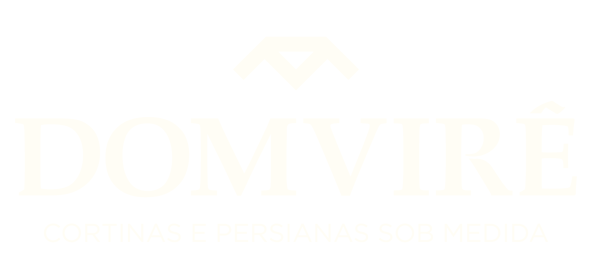

# Domvirê - Website Institucional



## Descrição do Projeto
Este é o **website institucional da Domvirê**, desenvolvido para apresentar a empresa, seus serviços e formas de contato de maneira moderna e responsiva.  
O site substitui o antigo projeto da marca "Nobres", com identidade visual atualizada (cores, fontes e logotipo).

O projeto foi criado como portfólio para mostrar habilidades em **HTML, CSS e JavaScript**.

---

## Tecnologias Utilizadas
- HTML5
- CSS3
- JavaScript (interações básicas)
- Imagens e logotipo da marca
- [GitHub Pages](https://pages.github.com/) (opcional para deploy online)

---

## Estrutura de Pastas
domvire-website/
│── index.html # Página inicial
│── sobre.html # Página "Sobre a empresa"
│── servicos.html # Página "Serviços"
│── contato.html # Página "Contato"
│
├── assets/
│ ├── css/
│ │ └── style.css # Estilos globais
│ ├── img/ # Logotipo e imagens da marca
│ └── js/
│ └── script.js # Funções de interação
│
└── README.md # Documentação do projeto


---

## Funcionalidades
- Menu de navegação fixo e responsivo
- Banner inicial com destaque da marca
- Sessões de serviços apresentados em cards
- Página de contato com formulário simples
- Rodapé com links para redes sociais e informações da empresa
- Design moderno e responsivo para diferentes dispositivos

---

## Como Rodar Localmente
1. Clone este repositório:

```bash
git clone https://github.com/Honorio15/domvire-website.git
```
Abra a pasta clonada e rode o arquivo index.html no seu navegador.

Se estiver usando XAMPP ou outro servidor local, coloque a pasta dentro do htdocs e acesse via http://localhost/domvire-website.
